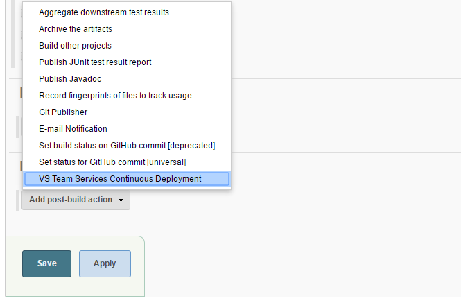
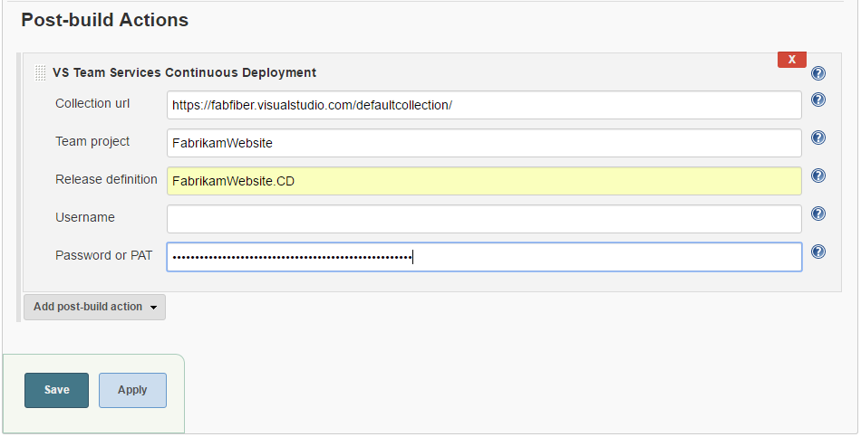

# Announcement
The functionality of this plugin has been moved to [TFS plugin](https://github.com/jenkinsci/tfs-plugin) with enhanced functionality. The use of this plugin is now **deprecated**. The repository will also be passively monitored. 

## Visual Studio Team Services Continuous Deployment

[MSDN documentation](https://blogs.msdn.microsoft.com/visualstudioalm/2016/05/27/continuous-deploymentdelivery-with-jenkins-and-vs-team-services/)

This plugin lets you trigger a release in Visual Studio Team Services, through a post-build step in Jenkins.

### Overview
Once you have configured Continuous Integration (CI) with Jenkins to be able to build with every code checkin/commit, the next step toward automating your DevOps pipeline is to be able to deploy automatically by setting up the Continuous Deployment (CD) pipeline.

[VS Team Service Release Management](https://www.visualstudio.com/features/release-management-vs) service lets you automate your deployments so that you could deliver your apps/services easily and deliver them often. You can setup the CI and CD process all on VS Team Services. However, if you have the CI pipleine already set with Jenkins, VS Team Service has good integration points through its [APIs](https://www.visualstudio.com/integrate/api/overview#Releasepreview) that can let you interact with its release service from any other third-party - Jenkins in this case.

This plugin makes use these APIs that lets you trigger a release in VS Team Services or TFS, upon completion of a build in Jenkins. The plugin has a post build step - "VS Team Services Continuous Deployment".

### Install the "VS Team Services Continuous Deployment" plugin

Just like any other plugin installation, go to **Manage Jenkins** -> **Manage plugins**. Search for the plugin named "VS Team Services Continuous Deployment"  and install it.

### Using the plugin

Assuming that you have already [created the Release Definition](https://www.visualstudio.com/en-us/docs/release/author-release-definition/more-release-definition) and [linked the Jenkins as artifact source](https://www.visualstudio.com/en-us/docs/release/author-release-definition/understanding-artifacts#jenkins) in Vs Team Service - Release Manaegment, you need to follow the following steps at the Jenkins side to trigger releases automatically, upon build creation.

**0. Setup Release Definition with Jenkins as artifact source**
This document assumes that you have already set up the RM definition that uses Jenkins artifact to deploy. This means your build/job is configured properly and archives artifacts. If not, see the following video to set up Release Definition with Jenkins build

**1. Add the post build action**
Go to the Job configuration and add the post build action - **VS Team Services Continuous Deployment**.

**2. Fill in the required fields**
Fill in the details required for this post build action. You need the following details:
* **Collection URL:** e.g. https://fabfiber.visualstudio.com/**DefaultCollection** <- Note that you need the url till the collection.
* **Team project:** The VS Team Services Project in which you have defined the release definition.
* **Release definition:** The Release definition **name** that links this Jenkins job as an artifact source.

You need to now enter the credentials that lets Jenkins trigger a release with the latest completed build, on your behalf. If you are using VS Team Services, you just need to enter **PAT** with atleast "Release (read, write and execute)" scope. (Refer to this [link](https://www.visualstudio.com/en-us/get-started/setup/use-personal-access-tokens-to-authenticate) to understand how to create PAT). In case you are using TFS, you need to enter the **username** and **password**.

**3. All set. See CD in action**
You have now automated your deployment trigger thereby enabling continuous deployment i.e. a checkin/commit would trigger a build and that will trigger a release.
Go ahead and test your setup by manually triggering a build in Jenkins or by a code checkin/commit that kicks off Jenkins build which in turn will trigger the release in VS Team Services.

### FAQs
**1. If I have multiple artifacts linked in my Release Definition, will this plugin trigger a release?**  
**A:** Yes, it is supported from 1.3 version onwards.
